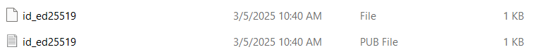
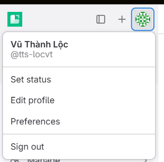
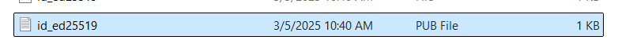
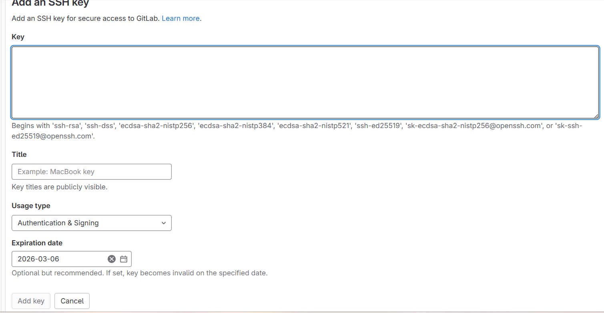
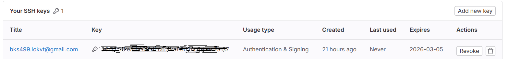

# Cách tạo khoá SSH và setup SSH Key cho tài khoản Gitlab
Chắc hẳn, trong quá trình sử dụng Gitlab nội bộ để lưu trữ source code, các bạn sẽ gặp phải trường hợp mỗi lần push code lên đều phải đăng nhập lại tài khoản, mật khẩu Gitlab. Đây là quá trình bảo mật tất yếu, tuy nhiên vì mỗi lần push đều phải đăng nhập thì rất tốn thời gian và khá bất tiện. Chính vì thế, hôm nay mình sẽ hướng dẫn các bạn tạo khoá SSH và setup cho tài khoản Gitlab của bản thân để mỗi lần push sẽ không cần đăng nhập lại tài khoản nữa.
## SSH Key là gì ?
SSH (Secure Shell) là một cặp mã hoá bao gồm 1 khoá riêng tư (Private Key) và 1 khoá công khai (Public Key) được sử dụng trong giao thức SSH để xác thực và bảo mật quá trình truyền tải dữ liệu và đăng nhập từ xa vào các máy chủ. SSH key thường được sử dụng để thay thế việc nhập mật khẩu khi kết nối đến một máy chủ từ xa.
## Phương thức hoạt động
Khi sử dụng SSH key với cặp khoá cụ thể, trong đó Public Key được đặt trên máy chủ từ xa cần truy cập, Private Key được giữ bí mật trên máy tính cá nhân. Khi có yêu cầu cố gắng kết nối đến máy chủ, người dùng sẽ gửi yêu cầu xác thực kèm theo Private Key của mình. Máy chủ sẽ kiểm tra xem Public Key tương ứng có danh sách cho phép hay không. Nếu thông tin phù hợp thì người dùng được cho phép truy cập, phương thức SSH được ưa chuộng bởi tính bảo mật cao hơn mật khẩu thông thường, đồng thời nó cũng thuận tiện hơn trong quá trình làm việc.
## Quy trình tạo cặp khoá và thêm vào tài khoản Gitlab
### Tạo cặp khoá
Đầu tiên, mở Git bash trên máy của bạn và gõ dòng lệnh sau:
``` 
ssh-keygen -t ed25519 -C "youremail@example.com"
```
Vì sao lại dùng "ed25519", đây là thuật toán mới nhất và hiện là tối ưu nhất so với các thuật toán cũ như RSA và ECDSA, cái này các bạn có thể google để hiểu thêm nha!
Sau khi chạy lệnh xong bạn sẽ thấy có dòng:
```
Enter file in which to save the key (/home/yourusername/.ssh/id_ed25519):
``` 
Nhấn enter để lưu khoá ở vị trí mặc định
### Thêm khoá vào tài khoản Gitlab
Đầu tiên, các bạn cần tìm khoá đã được tạo, thường nó sẽ nằm trong thư mục:
```
C:\Users\YourUsername\.ssh\
```
Hoặc bạn có thể dán đường dẫn vào thanh địa chỉ:
```
C:\Users\%USERNAME%\.ssh\
```
Bạn sẽ thấy một cặp khoá như sau


Tiếp theo, các bạn vào trang Gitlab của mình để thêm khoá



Chọn Preferences -> SSH Key


Sau đó, bấm Add new key để thêm khoá mới:


Tiếp theo, các bạn chuột phải vào file Pub, chọn Open with notepad, coppy toàn bộ nội dung và dán vào Text Area của Gitlab.





Sau đó sửa tiêu đề của key, chỉnh sửa Usage type theo nhu cầu, lựa chọn ngày hết hạn cho key, cuối cùng bấm Add key nó sẽ ra kết quả như sau:


Như vậy là đã thêm Public Key vào tài khoản thành công!
### Kiểm tra kết nối
Sau khi thêm Key xong, các bạn quay trở lại Gitlab, dùng lệnh sau để kiểm tra kết nối:
```
ssh -T git@gitlab-example
```
Nếu như có thông báo:

```
Welcome to GitLab, @yourusername!
```
Thì chúc mừng bạn đã liên kết thành công.

## Lời kết
Như vậy là mình đã hướng dẫn các bạn tạo SSH Key và cài đặt nó trên tài khoản của mình, nếu có bất kì thắc mắc hay câu hỏi gì các bạn có thể liên hệ mình qua Telegram: @lok2123. 
Nếu yêu quý mình, hãy nhớ thả tim và tặng Beki cho mình nhé, chúc các bạn tạo và thêm khoá SSH thành công!